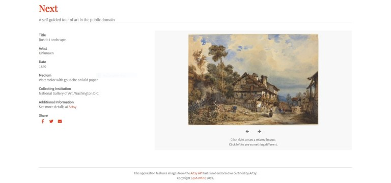
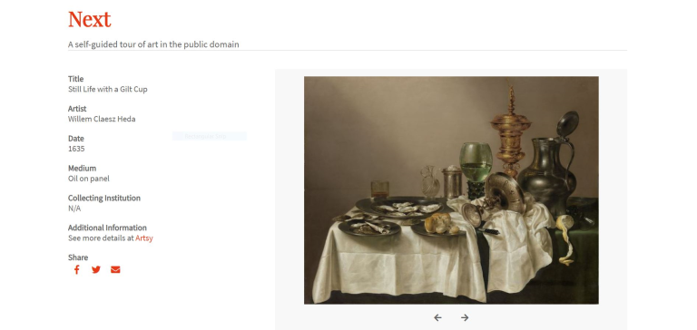
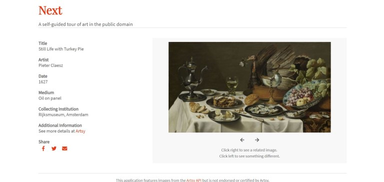
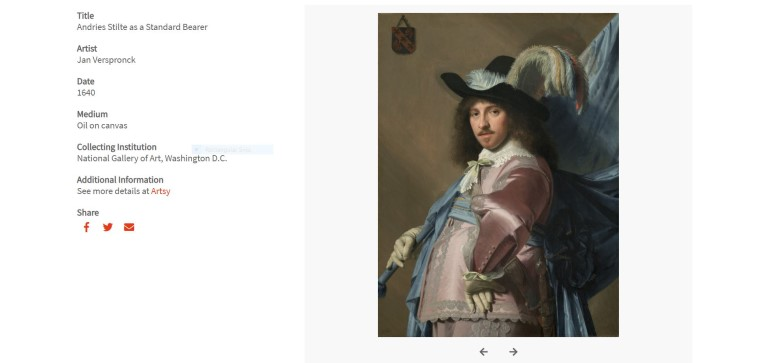
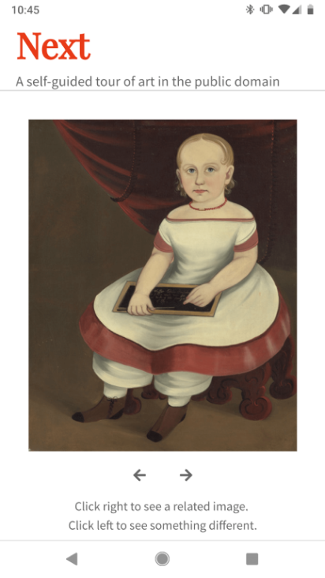

# Next
Next is an art gallery application that lets viewers explore both well-known and more obscure works of art in the public domain. Users can personalize their gallery walk by choosing to see related works or random selections from the collection.

## Motivation
Like many people, I never seem to make the time to go to museums or galleries anymore. I miss the experience, so I wanted to create an app that would let people study artworks on their own schedule, and at their own pace. 

## How It Works
At the landing page, the user can view a random image of open-access art. Using the navigation controls below the image, they can click right to see related artworks (related either by artist, subject, theme, technique, time period, etc.) or click left to see another random selection. Users can also share a link of the image to social media, if desired.

## Screenshots
Landing Page:  

  

An Example of Three Related Selections: The first image, a still-life painting from the Dutch Golden Age, was a result of a random selection, but the second two were related selections. The second image is another Dutch Golden Age still-life. And though the third image is a portrait, it is also an oil painting from a Dutch Golden Age painter.  

"Still Life With a Gilt Cup"  

"Still Life With Turkey Pie"  

  

"Andries Stilte as a Standard Bearer"  

  

Mobile View:  

  

## Technologies Used
- HTML
- CSS
- JavaScript
- jQuery

## Demo
- [Live Demo](https://leahawhite.github.io/Next/)

